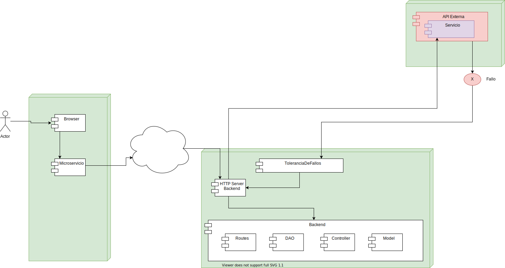

# Propuesta de solución para Hackathon Ceiba 2021

## Descripción de la solución 

Para atacar el problema el equipo plantea crear un microservicio que mediante un sistema de tolerancia de fallos pueda solucionar las peticiones retrasadas por los diferentes fallos que presente el api y no este disponible en el momento de realizacion de estas.

## Drivers que orientan la toma de decisiones para la solución propuesta

**Tolerancia a fallos:** El sistema debe seguir funcionando correctamente en caso de fallo de uno o varios de sus componentes.
**Mantenibilidad:** El sistema debera tener facilidad para la correccion de componentes defectuosos.
**Flexibilidad:* El microservicio debe tener el menor tiempo de inactividad posible.

## Diagrama de solución 

